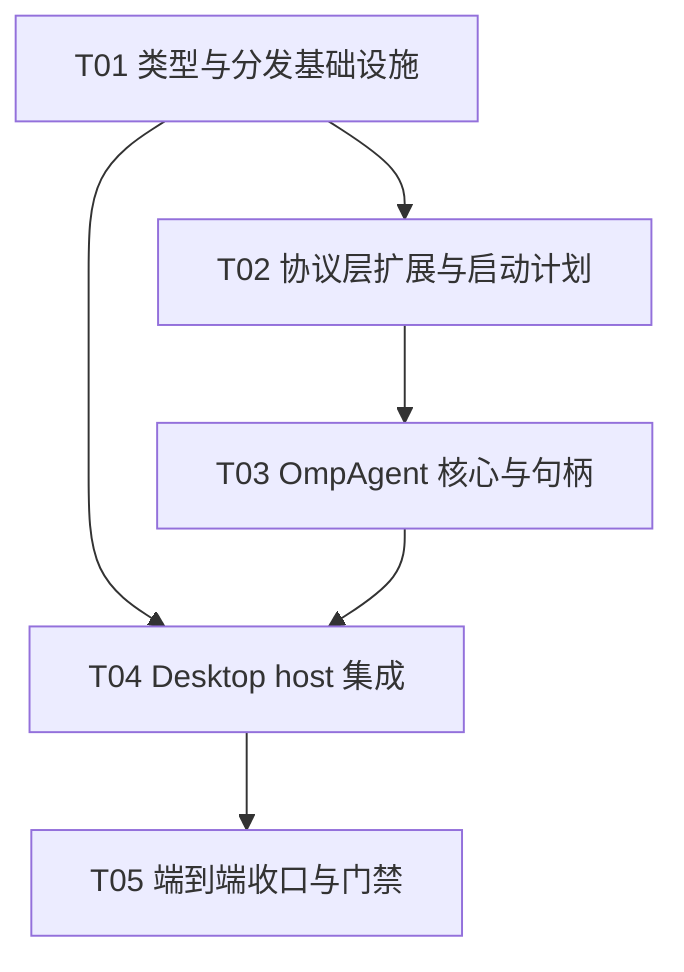

# OMP 接入 Lex GUI — 架构设计与任务分解

| 项 | 值 |
| --- | --- |
| 作者 | 高见远（Architect） |
| 状态 | 待评审 |
| 输入 | `docs/omp-gui-prd.md`、`docs/omp-rpc-spike.md`、`docs/omp-integration.md` |
| 目标工作树 | `F:\Projects\lex\app`（分支 `sync/cindy-20260911-v0.1.79`） |
| 上游基线 | `can1357/oh-my-pi` v18.1.18（锁死） |

> 本文所有代码事实均在 `app` 工作树或上游 v18.1.18 固定 tag 上核实过，标注了文件:行号。
> 代码示例遵循仓库强制风格：单引号、DCO `-s` 提交。

---

## 0. 阻塞项技术验证结论（§7.1，最先给出）

**结论：「OMP 只走 Cindy 托管」技术成立，非阻塞。** 注入路径不依赖环境变量，而是 OMP 官方支持的 **`models.yml` 自定义 provider**。

### 0.1 证据链

1. **OMP 自定义 provider 的官方入口是 `<agentDir>/models.yml`**（即 `~/.omp/agent/models.yml`；`agentDir` 被 `PI_CODING_AGENT_DIR` 覆盖后随之迁移）。上游 README（v18.1.18）与 <https://omp.sh/docs/providers> 均确认字段形态：

   ```yaml
   providers:
     cindy:
       baseUrl: http://127.0.0.1:<port>/v1   # loopback anthropic-compat 代理
       api: anthropic-messages                # 支持的 api 形态之一
       apiKey: CINDY_OMP_PROXY_KEY            # ← 关键：按环境变量名解析
       headers: {}                            # schema 支持（见下）
       models:
         - id: claude-sonnet-4-6
           name: Claude Sonnet 4.6
           contextWindow: 1000000
           maxTokens: 128000
   ```

2. **`apiKey` 优先按环境变量名解析，其次按字面量**——上游文档原文：*"apiKey is resolved as an environment-variable name first and otherwise as literal text. Prefer an environment-variable name so the secret stays out of the file."* 因此密钥只进子进程 env（host 在 launch plan 的 environment 快照里注入 `CINDY_OMP_PROXY_KEY` 占位值），**不落盘**，与 Pi 的 `$CINDY_PI_API_KEY` 插值机制（`pi-host.ts:742` 注释）安全等级一致。
3. **`headers` 字段存在**：上游 `packages/coding-agent/src/config/models-config.ts` 的 `validateProviderConfiguration` 显式校验 `headers?: Record<string, string>`，`baseUrl`/`apiKey`/`auth: none` 同样在 schema 内。**待验证点（非阻塞）**：headers 值是否支持 `$ENV` 插值未在文档中证实——若不支持，host 每会话重写一次受管 `models.yml`（文件在 `userData/omp-agent-home` 内，host 全权所有），把 per-session 的 `x-cindy-omp-session-id` / `x-cindy-omp-session-token` 字面量写进去即可，可接受。
4. **"OPENAI_BASE_URL 未生效"与上游设计一致**，不是缺陷：上游文档确认 base URL 环境变量只覆盖本地引擎（`OLLAMA_BASE_URL` / `LLAMA_CPP_BASE_URL` / `LM_STUDIO_BASE_URL`）；自定义端点**必须**走 `models.yml`。spike §7 的疑虑由此闭环。
5. **凭证优先级可控**：上游凭证链第一位是 `--api-key`，第二位就是 `models.yml providers.<id>.apiKey`——我们 pin 的 provider 块优先级高于任何存储态 OAuth，且受管 HOME 下不存在 OMP 自有 `auth.db`/`.env`（四个 `.env` 加载位置全部落在受管 HOME 内，host 不创建即不存在），路由确定。
6. **Cindy 托管端点形态可复用现有资产**：Pi 已证明「子进程 → loopback `anthropic-compat-proxy`（`anthropic-compat-proxy-host.ts`，`getClaudeEndpoint():1117`）→ 按 provider 头钉路由 → proxy 替换真实授权」全链路可行（`pi-host.ts:551-705` `buildPiSubscriptionNativeProviders` + `x-cindy-pi-provider-id` / `x-cindy-pi-session-id` / `x-cindy-pi-session-token` 三头，`anthropic-compat-proxy-host.ts` 路由判定）。OMP 走**同一 proxy、新增一条 `omp` 路由键**，不新建代理。
7. **Codex 的 Cindy 接入**（`codex-gateway-config.ts`：`-c model_providers.<id>.base_url=<proxy>`）是同一思想的另一形态，进一步佐证"loopback 代理 + 子进程内占位凭证"是仓内标准范式。

### 0.2 残留验证项（降级为真机 spike，不阻塞设计）

| 项 | 风险 | 处置 |
| --- | --- | --- |
| `models.yml` headers 是否支持 `$ENV` 插值 | 低 | 不支持则 host 按会话重写受管文件（§0.1-3） |
| OMP `anthropic-messages` 适配器经 compat proxy 的完整兼容（beta 头、OAuth 形态判定、system 段） | **中**——OMP 的 anthropic 适配器可能像 Pi 一样按 key 形态（`sk-ant-oat` 前缀）走 OAuth 分支（`pi-host.ts:130-144` 记录了 Pi 的这一判定），占位 key 形态需真机定 | T02 内安排 0.5 天真机验证；若不兼容，`api` 改 `openai-completions`/`openai-responses` 形态经 proxy 的对应路由（proxy 本身做多形态桥接） |
| `extension_ui_request(method: confirm)` 字段形态（PRD Q1） | 高（影响权限交互层范围） | 见 §4.4：按 `setWidget` 帧形态做防御性设计，字段级定型等真 provider 抓帧 |

---

## 1. 实现方案（Implementation Approach）

### 1.1 核心技术难点

1. **两套权限模型的桥接**：Lex 是"档位 + host 交互确认链"，OMP 是"静态 tier 门（`approvalMode`）+ `extension_ui_request` 交互"。映射必须分两层且遵守三条铁律（§4）。
2. **事件投影的可信边界**：OMP 低层帧不是可信 GUI DTO，必须经 translator 按类型逐项校验投影，禁止直接广播（`docs/omp-integration.md` 既有结论）。
3. **AgentKind 扩容面**：全仓 `'claude-code'|'codex'|'pi'` 联合字面量约 343 处 / 40+ 文件——但经核实 **DB 层零 migration**（§2.2，这是对旧判断的重要修正）。
4. **配置根隔离**：OMP 沿用 `PI_CONFIG_DIR` / `PI_CODING_AGENT_DIR` 环境变量（与 Pi 同名），极易误读 Pi 凭证；必须把 HOME 及全部 XDG/AppData 根重定向到受管 `omp-agent-home`。
5. **凭证注入不落盘**：`models.yml` 的 `apiKey` 按 env 名解析（§0.1-2），密钥只进子进程 env 快照。

### 1.2 框架与复用选择

| 决策 | 选择 | 理由 |
| --- | --- | --- |
| 协议层 | **复用** `packages/maker-core/src/agents/omp/` 现有 6 文件（rpc-client / jsonl-reader / stream-transport / process-lifecycle / process-host / commands） | 168 项测试背书，字节有界、生命周期六态、drain 语义都是生产级 |
| 事件投影 | 新建 `translator.ts`，职责边界对齐 `agents/pi/translator.ts`，**不抄实现**（协议不同） | pi/translator 是仓内"低层事件 → AgentEvent"的成熟范式 |
| Agent 骨架 | `OmpAgent extends BaseAgent`（`base-agent.ts:2351`），参照 `agents/pi/index.ts` 的 capabilities 声明与 session handle 组装 | 三个既有 agent 的统一抽象，UI 自动接入 |
| 模型接入 | 复用 `anthropic-compat-proxy-host` + catalog + capabilityAdditions，参照 `buildPiSubscriptionNativeProviders` 新建 `buildOmpSubscriptionProviders` | 凭证/路由/用量体系零新建 |
| 运行时下载 | 复用 `apps/desktop/src/main/agent-binaries/` 管线，`CONFIG` 加 `omp` 条目 | 进度、校验、用户可见态全部已有 |
| 探测层 | **删除** `probe-controller.ts` 与 desktop 四个 `omp-probe-*` / `omp-isolated-probe-host.ts`；`omp-probe-runtime.ts` 重写为 `omp-runtime.ts` | PRD §2.1 判定表 |

### 1.3 架构模式

- **分层**：协议层（maker-core/omp，纯 TS 无 Electron 依赖）→ Agent 层（OmpAgent/OmpSessionHandle/translator/permission-bridge）→ Host 层（desktop main：omp-host、omp-runtime、proxy 路由、注册）→ Renderer（复用现有会话 UI，零新页面）。
- **依赖方向**：renderer → maker-host → maker-core。协议层不 import host；host 通过 `AgentDeps` 注入 binaryPath/logger/spawn 原语。
- **Fail-closed**：一切解析失败、未知帧、未知 method、配置漂移 → 回落到最保守行为（ask 档 / 不响应 / 拒绝启动），绝不回落到放行。

---

## 2. AgentKind 扩容方案（§7.2）

### 2.1 重要修正：DB 层零 migration

team-lead 担心"`localDb/schema.ts` 6 处 Drizzle enum 列改动需要不可逆 migration"——**经核实不成立**：

- `schema.ts:625` 注释明确：*"drizzle 的 text enum 只是 TS 类型约束，SQLite 列无 CHECK，扩枚举不产生 migration（db:generate 应为 no-op）"*。
- `sessions.agentKind`（`schema.ts:117`）本来就是 `text('agent_kind').notNull().default('cc')`，**连 enum 声明都没有**，写入 `'omp'` 无需任何变更。
- 需要加 `'omp'` 的 5 处 enum 列：`schema.ts:360`（subagent runs）、`:727`、`:797`（delegation/provider）、`:1147`、`:1149`（daily model usage 的 `agentKind`/`modelAgentKind`）。

**结论**：纯 TS 类型扩展，`db:generate` 应为 no-op（需在 PR 中附 `db:generate` 无 diff 的截图/输出作为证据）；完全可逆；老数据零影响；**现在就改，不延后**。

### 2.2 SSoT 收敛策略

全仓 343 处联合字面量不宜一次手改。顺序即编译收敛顺序：

1. **改真源**：`packages/maker-core/src/types/common.ts:8` `AgentKind` 加 `'omp'`。
2. **让 tsc 当搜索引擎**：`pnpm --filter @cindy/maker-core build` → `desktop typecheck` → renderer typecheck，逐层修穷举失败点（`Record<AgentKind, …>`、`switch` 穷举、`never` 断言都会编译报错——`VENDOR_PRESENTATION` 这类 `Record<SelectableVendor, …>` 是好门禁，漏补即报错）。
3. **包间顺序**（依赖序）：`maker-core` → `maker-shared` → `lizi-mcps`（OMP 的 MCP 桥 P0 声明不支持）→ `maker-remote-ssh`（OMP 远端 P0 声明不支持，`remoteHostId` 直接抛 `NotSupportedError`）→ `apps/desktop/main` → `apps/desktop/renderer`。
4. **不建"AgentKind 注册表"之类的间接层**——现有穷举即门禁的设计是好的，加一层注册表反而会削弱编译期检查。SSoT = `types/common.ts` 的 union 本身。

### 2.3 分批改动顺序

| 批次 | 范围 | 收敛判据 |
| --- | --- | --- |
| B1 | `types/common.ts` + maker-core 内全部穷举 + `agents/omp/index.ts` 占位导出 | `pnpm --filter @cindy/maker-core build` 过 |
| B2 | maker-shared / lizi-mcps / maker-remote-ssh | 各包 build 过 |
| B3 | desktop main（schema.ts 5 处、agent-binaries、maker-host、IPC） | `desktop typecheck` 过 |
| B4 | renderer（`agentVendors.ts` / `agentOptions.ts` / `OmpMark.tsx` / `modelHarnessPresentation.ts` / i18n 五语言 / `--engine-badge-omp` 双主题变量） | renderer typecheck + hardcoded-color 审计 + 品牌门禁过 |

---

## 3. OmpAgent 设计（§7.3）

### 3.1 现有代码处置（与 PRD §2.1 一致）

| 文件 | 处置 |
| --- | --- |
| `omp/rpc-client.ts` | **保留并扩展**（§3.4 三个硬缺口） |
| `omp/jsonl-reader.ts` / `stream-transport.ts` / `process-lifecycle.ts` / `process-host.ts` | **原样保留** |
| `omp/commands.ts` | **保留**（P1 斜杠命令面板） |
| `omp/launch-plan.ts` | **重写**为生产会话启动计划（§3.5），函数名 `createOmpSessionLaunchPlan` |
| `omp/probe-controller.ts` + 对应测试 | **删除** |
| `desktop/maker-host/omp-probe-sandbox.ts` / `omp-probe-preflight.ts` / `omp-isolated-probe-host.ts` | **删除** |
| `desktop/maker-host/omp-probe-runtime.ts` | **重写为 `omp-runtime.ts`**（§6） |
| `tools/omp/latest.json` + `update.mjs` | **保留**（pin 真源） |

### 3.2 新增文件（maker-core）

| 文件 | 职责 |
| --- | --- |
| `agents/omp/index.ts` | `OmpAgent extends BaseAgent`：`kind='omp'`、capabilities 声明、`startSession()` 组装进程+RPC+句柄 |
| `agents/omp/session-handle.ts` | `OmpSessionHandle implements AgentSessionHandle`：send/steer/abort/close/events/getUsageSnapshot/setInteractionResolver/setModel/setPermissionMode |
| `agents/omp/translator.ts` | OMP 帧 → `AgentEvent`（17 种）投影，按会话+窗口跟踪，拒绝迟到/重复/跨会话 |
| `agents/omp/permission-map.ts` | 档位映射（Lex 三档 ↔ OMP `approvalMode`）纯函数 + 描述符 |
| `agents/omp/permission-bridge.ts` | 交互层：`extension_ui_request`/`ask_request` → `InteractionRequest`，fail-closed 收口 |
| `agents/omp/models-config.ts` | 受管 `models.yml` 内容的纯函数生成（provider 块、模型条目、env 名引用；不接触 fs） |
| `agents/omp/session-plan.ts`（并入 launch-plan.ts 亦可） | 新建/续接的 RPC 序列编排：`new_session` / `switch_session` / `get_state` 校验 |

### 3.3 类结构与接口

见 `docs/omp-gui-class-diagram.mermaid`。要点：

- `OmpAgent.capabilities` 静态声明：`permissionModes` 三档（ask/auto/bypassPermissions，description 写明"读取类工具始终自动放行"）、`setPermissionModeMidSession:{supported:true}`、`turnPermissionPolicy:{supported:{supported:true}, unsupportedPermissionModes:['bypassPermissions']}`（与 Pi 同口径，`pi/index.ts:1912`）、`planMode:{supported:false}`、`availableModels:[]`（由 host `capabilityAdditions` 注入）、`effort` 支持、无 Fast 开关、`fork/rewind` P0 不声明。
- `OmpSessionHandle.id` = OMP `sessionFile` 绝对路径（= Lex `sessions.sdkSessionId`，§5）。
- 事件出口只有一个：`handle.events`（`BaseAgent` 的 emitter 模式），translator 是唯一生产者。

### 3.4 rpc-client.ts 三个硬缺口的补法

1. **请求类型扩展**：`OmpRpcRequest` union 与 `REQUEST_TYPES` 集合增加 `steer` / `follow_up` / `new_session` / `switch_session` / `set_model` / `set_thinking_level` / `compact` / `export_html` / `set_session_name` / `get_available_models` / `get_messages` / `branch` / `get_branch_messages`（P0 只需前 8 个，其余随 P1 任务加）。每个新类型带自己的 payload 校验（参照现有 `prompt` 的 `message` 校验范式）。
2. **`respondToUi` 回传 `requestGeneration`**：`respondToUi(id, response, correlation?: { requestGeneration?: unknown })`——**防御性设计**：translator 收到 `extension_ui_request` 时原样快照其 `requestGeneration` 字段（存在才记），回传时 echo。帧没有该字段（spike 实抓两帧均无）则不带。**不按文档承诺盲传、也不丢已出现的字段**。
3. **`rpc_chunk`**：P0 维持现状（收到即关连接，v1 行为正确——spike §1 确认 v1 无分块），translator 在工具输出层做 1 MiB 截断标注；v2 协商 + 重组 P2。

### 3.5 生产 launch plan（重写要点）

`createOmpSessionLaunchPlan(input)` 与探测版的差异：

| 维度 | 探测版（废弃） | 生产版 |
| --- | --- | --- |
| cwd | `<sandbox>/home/workdir` | `StartSessionOptions.workingDir`（真实项目目录） |
| HOME 等根 | 每次新建一次性 sandbox | 每个 live runtime 在 `userData/omp-agent-home/runtimes/<opaque-id>` 下拥有独立受管 HOME；HOME / PI 配置 / agent / XDG / AppData 根都在该 runtime 内 |
| argv | `--no-session --no-tools …` | `--mode rpc --config <settings.yml> --approval-mode <档> --provider cindy --model <id>`；只保留 `--no-title` 给 Lex 管理任务标题。项目 MCP、extensions、Skills、Rules、LSP 与 PTY 均按 OMP 原生规则启用 |
| settings YAML | 探测最小集 | 追加 `tools.approvalMode` 与 `--approval-mode` 同值（双写防漂移）、`startup.setupWizard:false`、`startup.checkUpdate:false`、`enabledProviders:['cindy']`；不再强制关闭 `mcp.enableProjectConfig` |
| 环境 | 无凭证 | 注入 `CINDY_OMP_PROXY_KEY` 占位值 + `CINDY_OMP_SESSION_ID` / `CINDY_OMP_SESSION_TOKEN`；**不合并 `process.env`**。只由宿主白名单带入 PATH、shell / terminal / locale，或 Windows 的 SystemRoot、ComSpec、PATHEXT |
| models.yml | 无 | host 在 spawn 前物化到 `<PI_CODING_AGENT_DIR>/models.yml`（§3.6） |

**原生能力对齐**：早期的项目能力全关策略已经废弃。OMP 现在和 Claude Code、Codex、Pi 一样，让真实工作目录按上游规则发现项目 MCP、extensions、Skills、Rules、LSP 与 PTY；这不是把这些面宣称成 Lex 的额外授权或 OS 沙箱。Lex 仍拥有受管 provider / credentials、独立 runtime HOME、进程生命周期和标题，且从不复用 Pi 或用户 `~/.omp` 的配置与凭证。共享 `~/.agents/skills` 仅以受控链接投影到运行时 HOME；无法投影时降级为没有该全局来源，不会改写已有运行时目录。

OMP 的原生命令目录与文件扫描是两条不同的投影：live session 的
`get_available_commands` 直接作为 native command 目录提供；文件扫描仅显示尚未验证、
不可直接执行的 Skill。上游目录不携带 Skill 的路径或启动快照身份，因此同名
`skill:<name>` 不能证明某个具体 `SKILL.md` 已被该进程加载。Lex 不会把扫描结果提升为
`loaded`，也不会由扫描结果猜测 `/skill:<name>`；用户仍可从原生命令目录执行上游实际
公布的命令。

### 3.6 Cindy provider 注入（omp-host 侧）

host 新增 `buildOmpSubscriptionProviders(catalog, endpoint)`（参照 `pi-host.ts:551`）产出 `models.yml` 内容：

- provider id 固定 `cindy`；`baseUrl = appendEndpointPath(getClaudeEndpoint(), 'v1')`；`api: anthropic-messages`（真机验证不通过则回落 `openai-responses`，见 §0.2）；`apiKey: CINDY_OMP_PROXY_KEY`（env 名，非值）。
- headers 三件套（omp 命名空间）：`x-cindy-omp-session-id` / `x-cindy-omp-session-token` / `x-cindy-omp-provider-id`。proxy 侧 `anthropic-compat-proxy-host.ts` 加 omp 路由分支（照抄 pi 的钉路由逻辑，改头名）。
- 模型条目来自 host catalog（与 Pi 同源），compat/thinking/cost 元数据按 catalog 声明序列化。
- **每会话物化**：spawn 前 host 重写 `<agentDir>/models.yml`（`wx` 失败则覆盖写——文件受管）；session token = HMAC(sessionId) 与 Pi 同机制（`piEnvironment.ts` 的 createHmac 范式）。

### 3.7 事件投影（translator）

映射表按 PRD §9 执行，P0 子集：`message_update`(text/thinking/toolcall delta) → `text`/`thinking`/工具参数增量；`tool_execution_start/update/end` → `tool_use`/`tool_result(_full)`（update 有界截断 + "输出已截断"标注）；`agent_end`（`isTerminal!==false`）→ `done`；`auto_compaction_*` → `compact_boundary`；`auto_retry_*` → `status`；`model_changed`/`thinking_level_changed` → 回写 DB 的状态事件；`error` 帧 → `error`（按 `code` 族映射 auth/config/provider，`errorMessage` 脱敏——spike §5 确认 OMP 自带 key 遮蔽，仍不透原文）；`prompt_result` 不合成完成事件；`extension_ui_request`/`ask_request` → 交 permission-bridge，**不进事件流**。

防串台：translator 持有 `(sessionId, windowId)` 绑定；未知/过期 `clientId`、跨会话帧、重复 `message_end` → 丢弃 + 脱敏日志。`open_url` 一律不自动打开（`respondToUi({cancelled:true})` + 提示卡）。

---

## 4. 权限桥设计（§7.4）

### 4.1 档位映射表（P0 唯一权威）

| Lex `PermissionMode` | OMP `approvalMode` | read | write | exec | 说明 |
| --- | --- | --- | --- | --- | --- |
| `ask`（默认） | `always-ask` | 自动放行 | 每次询问 | 每次询问 | **文案必须写明"读取类工具始终自动放行"** |
| `auto`（自动审查） | `write` | 自动放行 | 自动放行 | 每次询问 | |
| `bypassPermissions`（完全访问） | `yolo` | 自动放行 | 自动放行 | 自动放行 | 用户显式 deny 与危险命令 override 仍生效 |

- **`acceptEdits` 无对应、不暴露**：OMP 三档是 read/write/exec 三 tier 的单调门，没有"只放行编辑、其余维持询问"这一档（`write` 档同时放行了 read——而 read 在 OMP 任何档下都放行）。`capabilities.permissionModes` 只声明上表三档；`default`/`plan` 同样不暴露。
- 双写：`--approval-mode` CLI flag + settings YAML `tools.approvalMode` 同值，防 OMP 默认 `yolo` 兜底。

### 4.2 三条铁律的落地

1. **Lex 权限链是唯一授权源**：`approvalMode` 只是递给 OMP 的节流档位；所有交互确认（若存在）必须经 `setInteractionResolver` → `InteractionRequest{kind:'permission'}` → GUI 权限卡。translator/bridge 中**不存在**任何"自动 allow"路径（除 §4.3-5 的升档收口）。
2. **禁止名称等价映射**：映射由 `permission-map.ts` 的显式表驱动（不是字符串对应）；`always-ask` 下 read tier 仍放行这一事实写进 capabilities description 与 i18n 文案，不对用户撒谎。
3. **禁止谎报保护**：OMP 内部自动放行的操作不得标记"已受 Lex 保护"；**OMP 原生 TUI 确认弹窗 ≠ Lex 权限卡**——RPC 模式下若出现绕过 `extension_ui_request` 的原生确认行为（进程挂起等待 stdin 非协议输入等异常形态），bridge 立即拒绝挂起请求并关闭连接（`process-lifecycle` 的 stopping 语义），会话置可恢复。

### 4.3 交互层与 Fail-closed

按 PRD §5.3 全表执行。关键机制：

1. 未登记 `requestId` / 会话不匹配 / 会话已关 → 不响应 + 脱敏日志。
2. 单会话同时只允许 1 个 pending permission；第二个到达立即 `respondToUi({cancelled:true})`。
3. `respondToUi` 回传 `requestGeneration`（§3.4-2 防御性 echo）。
4. P0 不做"总是允许"桥接；P1 由 Lex 进程内维护"本会话已放行 toolName 集合"代答（不得要求 OMP 记住）。
5. 超时：`min(frame.timeout, 60s)`，无 timeout 默认 30s；归零 → `{cancelled:true, timedOut:true}` + `interaction_dismissed` + SystemCard；abort/close → 全部 pending `{cancelled:true}`；挂起期间升档 → `interaction_dismissed(resolvedAs:'allow')` + `{confirmed:true}` + 系统卡（与 Claude 现有行为一致）。
6. **配置解析失败回落 ask**：`permission-map.ts` 对任何未知/缺失档位值返回 `always-ask`，**绝无到 yolo 的路径**。

### 4.4 `confirm` 帧的待定标注与防御设计

`extension_ui_request(method:'confirm')` 的字段级形态**未抓到**（spike §0，需真 provider）。设计如下，标注"待定，需真 provider 验证"：

- **请求侧**：按已抓到的 `setWidget` 帧形态（`{type, id:<16hex>, method, ...methodSpecific}`）推断 confirm 帧至少含 `id`、`method:'confirm'`、可能含 `title`/`description`/`timeout`/`requestGeneration`。bridge 的解析器按**可选字段**建模：出现的字段原样消费，缺失的用 toolName=input 摘要兜底；未知字段忽略不报错。
- **响应侧**：`{type:'extension_ui_response', id, confirmed:true|false}` + 条件 echo `requestGeneration`（§3.4-2）。
- **若真机证实 confirm 帧不存在**（审批只在 TTY 发生）：P0 权限只剩 §4.1 静态三档门，交互确认整体降 P1，权限选择器文案与首次使用提示**明示**"OMP 的 Ask/Auto 档保护弱于其它引擎"——不对用户撒谎（PRD Q1 的既定降级路径）。

### 4.5 会话中途热切换

OMP 设置启动期加载，`setPermissionMode(mode)` 落地为：**当前 turn 空闲 → 关旧进程并确认整棵树退出（`stopAndWait() === true`）→ 以新 `--approval-mode` 重启进程 → `switch_session{sessionPath}` 续接 → `get_state` 校验 sessionFile 未漂移**。同一 JSONL 不允许被两个 OMP 进程并发 attach，因此旧进程尚未确认退出时绝不启动替换进程。UI 显示一次性"正在应用权限设置"状态；旧进程已停止而替换失败时，会话 fail-closed 并要求重新打开任务，不能假装回滚到一个已退出的旧档位。

---

## 5. 会话体系（§7.5）

| Lex | OMP | 说明 |
| --- | --- | --- |
| `sessions` 一行 | 一个 OMP session（JSONL 会话文件） | 1:1 |
| `sessions.agentKind='omp'` | — | 无需 migration（§2.1） |
| `sessions.sdkSessionId` | **`sessionFile` 绝对路径** | `switch_session` 只接受 `sessionPath`（`get_state` 返回，spike §6b） |
| 历史消息 | Lex DB `messages` 表 | 与其它 agent 一致，不读 OMP JSONL；`get_messages` 仅兜底修复 |

- **新建**：spawn（cwd=workingDir）→ `ready` → `new_session` → `get_state` 拿 `sessionFile` → 落库。
- **续接**：`startSession({resumeSessionId})` → spawn → `switch_session{sessionPath:resumeSessionId}` → `get_state` 校验 `sessionId` 未漂移；失败走 `StartSessionOptions.onInvalidResumeSession` CAS 回调，**不得静默 fresh fallback**。
- **持久化根**：`userData/omp-agent-home/`；`--session-dir` 指到 `<home>/.omp/agent/sessions`（受管根内）。**绝不复用** `~/.omp` / `~/.pi`；**OMP↔Pi 会话身份禁止静默互换**（不同上游，`sdkSessionId` 不通用；renderer 的 session-agent-switch 对 omp 目标直接隐藏）。
- `/clear` → `new_session` + 新 `sessionFile` 写回 DB；会话标题 Lex 自产（`--no-title` + RPC 默认抑制 `setTitle`，天然一致）。

---

## 6. 二进制分发方案（§7.6，自主可控）

### 6.1 双轨

| 阶段 | 来源 | 落点 |
| --- | --- | --- |
| 开发 | `pnpm install:omp`（`tools/omp/update.mjs`，GitHub Release + sha256/size/URL 三重复核） | `apps/omp-bin/<platform>/omp(.exe)` |
| 打包 | **Lex 可控镜像**（见 §6.3）+ `config/lex-agent-runtime-assets.json` 新增 `omp` 字段 | `userData/omp/<version>/omp(.exe)` |

### 6.2 改动清单

1. `apps/desktop/src/main/agent-binaries/index.ts`：`AgentBinaryKind` 加 `'omp'`；`CONFIG` 加 `{ vendorKey:'omp', manifestField:'omp', installSubdir:'omp', binaryName:'omp(.exe)', devBinDir:'omp-bin', vendorTag:'omp', optionalAsset:true, preserveLocalVersion:true }`。`artifactKind` 现有类型为 `'gz'|'tar-gz-dir'`（`:135`）——OMP 是单文件裸二进制，**扩 union 加 `'raw'`**（运维若决定 CDN 侧压缩则用既有 `'gz'`）。
2. `types.ts` `VendorKey` 加 `'omp'`。
3. `config/lex-agent-runtime-assets.json`：4 平台各加 `omp:{version,file,sha256,size}`，与 `tools/omp/latest.json` 逐字一致。
4. `scripts/ensure-agent-binaries.mjs`：`KINDS.omp` 保留 `defaultInstall:false`、`strictPinnedRuntime:true`。
5. `omp-probe-runtime.ts` → `omp-runtime.ts`：去 dev-only 限制；保留 pin 全量复核 + `timingSafeEqual`；接 `agent-binaries` 受管路径解析；spawn 前过 `isVettedAgentBinaryPath('omp', candidate)`。`OMP_COMPATIBILITY_BASELINE` 与 pin 同值，**本地更高版本拒绝启动**（PRD Q4 锁死策略）。

### 6.3 Cindy CDN 不可控下的自主可控

- `cdnBaseUrl` 当前指 `https://hotfix.cindy.app/cindy`（Cindy 官方）。方案：**运维将 4 平台 OMP 二进制镜像到 Lex 可控对象存储**（自有 CDN/对象存储，域名归 Lex 品牌），`lex-agent-runtime-assets.json` 的 `omp` 条目使用**条目级 `baseUrl` 覆盖**（若现有 manifest schema 不支持条目级 baseUrl，则给 `agent-binaries` 加一个 per-kind `cdnBaseUrlOverride` 配置项，仅 omp 使用）。镜像发布动作由 `tools/omp/update.mjs` 的同一 pin 复核把关。
- **国内速度**：走镜像而非 GitHub Release 直连；下载管线复用现有 agent-binaries 的进度/重试；断点续传若管线不支持则列为运维优化项，不阻塞。
- **平台 gap**：P0 只做 4 平台；`linux-arm64`/`win32-arm64` 在 `omp-runtime.ts` 返回明确"平台不支持"（PRD Q9）。

### 6.4 用户可见行为

按 PRD §8.3 五态执行：未安装角标 + 确认框（"约 150–200 MB"）+ 字节进度；失败置灰 + 脱敏 tooltip + 重试；版本不匹配按校验失败处理；取消清理半成品；**进启动页串行下载链但不把它打进失败态**：OMP 与 claude／codex／pi 共用同一条受管下载队列（同一 provisioner、同一 SHA-256 门，只是源为上游 GitHub Release），显示真实字节进度，配独立有界 deadline（`OMP_AGENT_INSTALL_STARTUP_DEADLINE_MS`，当前 90s）——慢网下启动页会带着真实进度等满这段预算，这是已知代价；超时或网络类失败转后台按网络恢复重试，不可重试的终态退回 remote-only；已有 OMP 会话在运行时缺失时 composer 只读 + 错误条，**不自动切引擎**。

> 顺序约束（rc.2 实际故障）：OMP 的准备必须**早于** Maker 构造。`Maker.registerAgent`
> 是加法幂等的，先注册的 remote-only agent 在整个进程内换不掉；若 Maker 在二进制落盘前
> 构造，本地 OMP 会永远接不进去。因此除 `ready` 与「本地已无希望」外，`buildOmpAgent`
> 一律**什么都不注册**，把位置留给下载完成后的本地版 agent。「本地已无希望」=
> `platform-unsupported`，或 `download-failed` 且错误码不可重试（与 recovery 的
> `isRetryableOptionalRuntimePrepareError` 同一把尺子）。

---

## 7. 程序调用流

见 `docs/omp-gui-sequence-diagram.mermaid`，覆盖四条关键链路：① 新建会话（含 models.yml 物化 + ready + new_session + 落库）；② 续接会话（switch_session + CAS 校验）；③ 发消息 + 流式事件投影；④ 权限确认（extension_ui_request → 权限卡 → respondToUi + generation echo）与会话中途切档（重启续接）。

---

## 8. 任务分解（Part B）

### 8.1 Required Packages

无新增第三方依赖。协议层为仓内自研（`docs/omp-integration.md`："未引入上游代码或新增 npm 依赖"），全部复用 workspace 内现有包：

```
- @cindy/maker-core (workspace): Agent 抽象、事件类型、OMP 协议层
- @cindy/maker-shared (workspace): 共享类型
- @cindy/anthropic-compat-proxy (workspace): loopback 代理
- drizzle-orm (已有): localDb schema（零 migration，§2.1）
```

### 8.2 任务列表（按依赖排序，P0 最小闭环 = T01–T05 全部）

| Task | 名称 | 涉及文件 | 依赖 | 优先级 |
| --- | --- | --- | --- | --- |
| **T01** | **类型与分发基础设施（AgentKind 扩容 + 运行时管线 + 引擎表）** | `packages/maker-core/src/types/common.ts`；`apps/desktop/src/main/localDb/schema.ts`（5 处 enum，零 migration）；`apps/desktop/src/main/agent-binaries/index.ts`+`types.ts`；`config/lex-agent-runtime-assets.json`；`scripts/ensure-agent-binaries.mjs`；renderer：`lib/agentVendors.ts`、`components/new-chat/agentOptions.ts`、`components/icons/OmpMark.tsx`、`lib/modelHarnessPresentation.ts`、双主题 `--engine-badge-omp` CSS 变量、i18n 五语言权限三档文案；maker-shared/lizi-mcps/maker-remote-ssh 的穷举补齐 | — | P0 |
| **T02** | **OMP 协议层扩展与生产启动计划** | `agents/omp/rpc-client.ts`（请求类型扩展 + requestGeneration echo）；`agents/omp/launch-plan.ts`（重写为 `createOmpSessionLaunchPlan`）；`agents/omp/models-config.ts`（新建，models.yml 纯函数生成）；`agents/omp/permission-map.ts`（新建，档位映射 + fail-closed 回落）；删除 `agents/omp/probe-controller.ts`；对应测试改写（保留协议层测试，删探测测试）；**含 0.5 天真机验证：models.yml provider 经 compat proxy 的 anthropic-messages 兼容性 + confirm 帧抓帧**（§0.2/§4.4） | T01（AgentKind） | P0 |
| **T03** | **OmpAgent 核心与会话句柄** | `agents/omp/index.ts`（OmpAgent + capabilities）；`agents/omp/session-handle.ts`；`agents/omp/translator.ts`（事件投影）；`agents/omp/permission-bridge.ts`（交互层 fail-closed）；`agents/omp/session-plan.ts`（新建/续接编排）；单测（translator 逐帧、bridge 收口、resume 漂移） | T02 | P0 |
| **T04** | **Desktop host 集成与探测层拆除** | `apps/desktop/src/main/maker-host/omp-host.ts`（buildOmpAgent + buildOmpSubscriptionProviders + models.yml 物化）；`apps/desktop/src/main/maker-host/omp-runtime.ts`（重写）；`anthropic-compat-proxy-host.ts`（omp 路由分支）；`maker-host/index.ts`（`_registerOmpAgent` + `registerOmpAgentIfAvailable` + `AGENTS_CHANGED`，照抄 `:2690`/`:2770` Pi 链路）；**删除** `omp-probe-sandbox.ts`/`omp-probe-preflight.ts`/`omp-isolated-probe-host.ts`；运行时未就绪/下载中/失败三态 UI 接线 | T01, T03 | P0 |
| **T05** | **端到端收口与门禁** | 会话持久化路径联调（sdkSessionId=sessionFile、续接、历史）；`PermissionSelector` i18n 五语言校验；P0 验收清单（PRD §10）逐项过；`pnpm check:brand-terminology`、prettier 单引号、ESLint、maker-core build、desktop typecheck、hardcoded-color 审计、light/dark 双模式、`db:generate` no-op 证据；`docs/omp-integration.md` 进度更新 | T04 | P0 |

### 8.3 Shared Knowledge（跨任务约定）

```
- AgentKind SSoT = packages/maker-core/src/types/common.ts 的 union；不建注册表间接层。
- Drizzle text enum 无 SQLite CHECK：扩 enum 零 migration；PR 必须附 db:generate no-op 证据。
- sdkSessionId = OMP sessionFile 绝对路径（不是 sessionId）；OMP↔Pi 会话身份禁止互换。
- 凭证只进子进程 env：models.yml 的 apiKey 写 env 变量名（OMP 按 env 名优先解析）；
  environment 快照 100% 显式提供，任何代码不得合并 process.env。
- HOME/PI_CONFIG_DIR/PI_CODING_AGENT_DIR/XDG_*/APPDATA 全部指向 userData/omp-agent-home；
  绝不读写 ~/.omp、~/.pi。
- 权限 fail-closed：解析失败→always-ask；未知帧/method→不响应+cancelled；无默认 allow。
- respondToUi 必须条件 echo requestGeneration（帧有才回）。
- 低层帧不是可信 GUI DTO：renderer 只消费 translator 产出的 AgentEvent。
- 品牌：桌面/运行时分发=Lex；账号/订阅/托管模型/代理头(x-cindy-*)=Cindy；
  check:brand-terminology 为硬门禁；引擎显示名 "OMP" 不进 i18n。
- 代码风格：单引号；提交 git commit -s（DCO）。
- 版本锁死：OMP_COMPATIBILITY_BASELINE === tools/omp/latest.json.version === 18.1.18；
  本地更高版本拒绝启动。
```

### 8.4 任务依赖图



---

## 9. 未决项与假设（Anything Unclear）

1. **`extension_ui_request(method:confirm)` 字段形态**：未抓到（需真 provider）。按 §4.4 防御设计；若不存在则交互层降 P1 + 文案明示（PRD Q1 降级路径）。**这是最大技术风险。**
2. **OMP anthropic 适配器经 compat proxy 的兼容性**：占位 key 形态判定（类 Pi `sk-ant-oat` 机制）未实测；回落路径为 `openai-responses` 形态（§0.2）。
3. **`models.yml` headers 是否支持 `$ENV` 插值**：未证实；按"不支持"设计（host 按会话重写受管文件）。
4. **热切换档位的进程重启窗口**：重启+续接约 1–3s 的会话空窗，用户可见状态条已设计；若上游未来支持 `config_update` RPC 可改热写（P1 评估）。
5. **`branch`/`get_branch_messages` 的 entryId 语义**：P1 才接入，届时需对照上游 rpc-types.ts 核对。
6. **假设**：`agent-binaries` manifest 支持（或可小改支持）条目级 `baseUrl` 覆盖；若不可行，运维需将 OMP 镜像放进现有 Cindy CDN 路径（与"不可控"前提冲突时再升级决策）。
7. **假设**：renderer 的 `session-agent-switch` 对 omp 隐藏目标项的具体落点在 T05 联调时确认（本会话身份不通用原则不变）。
